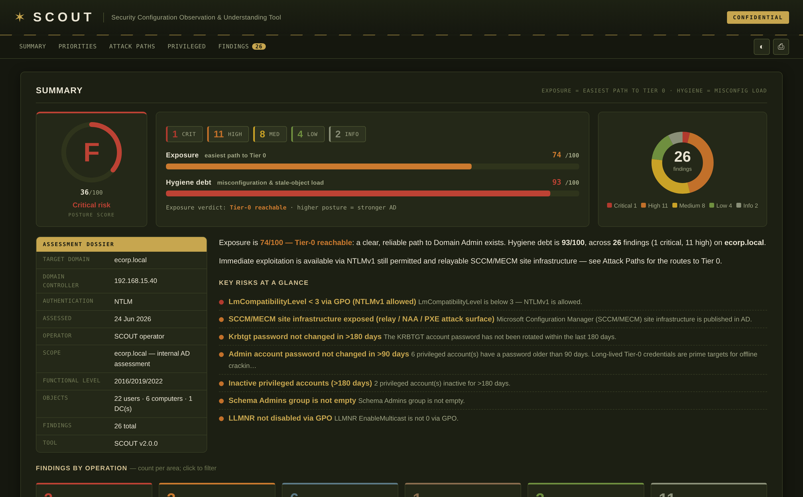

# SCOUT



Security Configuration Observation & Understanding Tool — an offline Active
Directory security assessment that runs from a non-domain-joined Linux host.

SCOUT collects AD configuration over LDAP/LDAPS and SMB/SYSVOL, evaluates it
against a rule set covering privilege escalation, credential access, lateral
movement, persistence, and hygiene, and writes an interactive single-file HTML
report plus optional JSON and CSV.

## The report

- **Posture score + A–F grade** headline (higher = stronger), backed by two risk
  axes: **Exposure** (easiest path to Tier-0) and **Hygiene debt**.
- **Priorities — ranked by exploitability.** A "Top Priorities" list ordered by
  real attacker impact (effort-to-Tier-0), plus **Quick Wins** (low remediation
  effort, high payoff). Every finding carries a **remediation-effort** rating.
- **Findings you can act on.** Each finding expands to attack-path, evidence, an
  attacker view, copy-able exploitation commands, remediation, and **framework
  mappings** (MITRE ATT&CK + Mitigations, CIS Controls v8, NIST CSF).
- **Rich affected-object tables** (enabled / created / password-set / last-logon
  / flags) with per-table **CSV export**.
- **Attack paths** and a clickable **control-path graph** to Domain Admin, a
  **privileged-accounts** explorer, inventory, and a **trust map**.

See `examples/sample_report.html` for a full example and `docs/ROADMAP.md` for
what's next.

## Install

Python 3.9+ and the packages in `requirements.txt` (`ldap3`, `impacket`,
`pycryptodome`):

```bash
pip3 install -r requirements.txt
```

## Usage

```bash
# Password
./scout.py -d corp.local -u jdoe -p 'P@ssw0rd' --dc-ip 10.0.0.10

# Pass-the-hash
./scout.py -d corp.local -u jdoe -H :<NThash> --dc-ip 10.0.0.10

# Kerberos: request a TGT from the password (use when LDAP signing or channel
# binding is enforced)
./scout.py -d corp.local -u jdoe -p 'P@ssw0rd' -k --dc-ip 10.0.0.10

# Overpass-the-hash / AES key
./scout.py -d corp.local -u jdoe -H :<NThash> -k --dc-ip 10.0.0.10
./scout.py -d corp.local -u jdoe --aes-key <hex> --dc-ip 10.0.0.10

# Reuse an existing ccache
KRB5CCNAME=jdoe.ccache ./scout.py -d corp.local --dc-ip 10.0.0.10
./scout.py -d corp.local --ccache jdoe.ccache --dc-ip 10.0.0.10

# Extra outputs and report metadata
./scout.py -d corp.local -u jdoe -p 'P@ssw0rd' --dc-ip 10.0.0.10 \
    --json --csv --operator "Red Team" --scope "Internal — HQ"
```

When a bind returns `strongerAuthRequired` (signing/channel binding enforced) and
usable credentials are present, SCOUT upgrades to Kerberos.

### NetExec

`integrations/nxc/scout.py` runs the engine as a NetExec `ldap` module. Directory
data reuses nxc's authenticated LDAP connection (no second bind); SMB/SYSVOL
checks open a separate SMB connection using the same credentials.

```bash
# Deploy
cp integrations/nxc/scout.py ~/.nxc/modules/scout.py
export SCOUT_PATH=/path/to/SCOUT/scout.py   # or pass -o PATH=/path/to/scout.py

# Run
nxc ldap <dc> -u user -p pass -M scout                 # writes scout_<domain>.html
nxc ldap <dc> -u user -H :<NThash> -k -M scout
nxc ldap <dc> -u user -p pass -M scout -o NO_SMB=true JSON=true
```

Module options (`-o KEY=value`):

| Option | Purpose |
| --- | --- |
| `PATH` | Path to scout.py (else `$SCOUT_PATH`, else `./scout.py`) |
| `OUTPUT` | HTML report path |
| `JSON` | JSON output path (`true` for default name) |
| `NO_SMB` | Skip SMB/SYSVOL checks |
| `NO_PATHS` | Skip control-path analysis |
| `NO_ADCS` | Skip ADCS checks |

### Options

| Option | Purpose |
| --- | --- |
| `-k`, `--kerberos` | Request a TGT and bind with Kerberos |
| `--ccache FILE` | Reuse an existing ccache (also honors `KRB5CCNAME`) |
| `--save-ccache [FILE]` | Save the obtained TGT for reuse |
| `--aes-key HEX` | Kerberos AES key |
| `--ldaps` | Use LDAPS (636) |
| `--dc-host FQDN` | DC FQDN for the Kerberos SPN (auto-resolved otherwise) |
| `--no-smb` / `--no-adcs` / `--no-paths` | Skip SMB/SYSVOL, ADCS, or control-path analysis |
| `--accurate-logon` | Reconcile `lastLogon` across every DC for privileged-inactivity findings |
| `-o FILE` | HTML report path (default `scout_<domain>_<ts>.html`) |
| `--json` / `--csv` | Also write JSON / CSV findings |
| `--operator` / `--scope` | Report cover metadata |

The HTML report is always written (`scout_<domain>_<ts>.html` by default, or `-o`);
`--json` / `--csv` add machine-readable findings for diffing across scans.
